# WebReader 🌐

WebReader is an intelligent web content analysis system that lets you ask questions about any webpage and get accurate, citation-backed answers. Instead of manually reading through long articles, simply provide a URL and your question - WebReader will extract the relevant information and provide precise answers with source citations.

The system uses advanced RAG (Retrieval-Augmented Generation) techniques to understand your query, intelligently search through the web content, and generate comprehensive responses with exact source references.

## 🏗️ Architecture Overview

```mermaid
%%{init: {'theme':'base', 'themeVariables': {'primaryColor': '#ffffff', 'primaryTextColor': '#000000', 'primaryBorderColor': '#000000', 'lineColor': '#000000', 'secondaryColor': '#ffffff', 'tertiaryColor': '#ffffff', 'background': '#ffffff', 'mainBkg': '#ffffff', 'secondBkg': '#ffffff', 'tertiaryBkg': '#ffffff'}}}%%
graph TD
    subgraph "WebReader Search & Response System"
        %% Input
        A[Web URL] --> B[Content Extraction]
        A1[User Query] --> C1{Query Classification}
        
        %% Content Processing
        B --> B1[Text Chunking]
        B1 --> B2[Vector Embeddings]
        B2 --> B3[Search Index]
        
        %% Query Intelligence
        C1 -->|Generic| C2[Extract Keywords]
        C2 --> C3[Query Expansion]
        C1 -->|Specific| C4[Enhanced Query]
        C3 --> C4
        
        %% Search Process
        C4 --> D1[Query Embedding]
        D1 --> D2[Vector Similarity Search]
        B3 --> D2
        D2 --> D3[Top 5 Results]
        
        %% Response Generation
        D3 --> E1[Generate Response]
        E1 --> E2[Citation Processing<br/>& Markdown Formatting]
        E2 --> F1[Final Response]
        
        %% Output
        F1 --> F2[Text Answer]
        F1 --> F3[JSON Artifact]
        F1 --> F4[Hyperlinked Citations]
    end
    
    %% Color Coding
    classDef webOps fill:#e3f2fd,stroke:#1976d2,stroke-width:2px
    classDef llmCalls fill:#fff3e0,stroke:#f57c00,stroke-width:2px
    classDef vectorOps fill:#f3e5f5,stroke:#7b1fa2,stroke-width:2px
    classDef queryOps fill:#e8f5e8,stroke:#388e3c,stroke-width:2px
    classDef outputOps fill:#f1f8e9,stroke:#689f38,stroke-width:2px
    classDef external fill:#fafafa,stroke:#757575,stroke-width:1px
    
    %% Apply styles
    class A,B,B1 webOps
    class C2,C3,E1 llmCalls
    class B2,D1,D2,B3 vectorOps
    class C1,C4,D3 queryOps
    class E2,F1,F2,F3,F4 outputOps
    class EXT1,EXT2,EXT3,EXT4,EXT5,EXT6,EXT7,EXT8 external
```

## How It Works

WebReader processes web content through a sophisticated pipeline that combines content extraction, semantic understanding, and intelligent querying:

**Content Processing**: The system fetches web pages and breaks them into searchable chunks, then converts each chunk into high-dimensional vectors using OpenAI's embedding models. These vectors are stored in a FAISS index for fast similarity search.

**Smart Query Handling**: When you ask a question, WebReader first classifies whether it's a general question (like "what is this about?") or a specific one (like "what are the side effects?"). For general questions, it enhances your query with key concepts from the content to find better matches.

**Semantic Search**: Your question is converted to a vector and matched against the content chunks using cosine similarity. The system finds the most relevant sections and generates a comprehensive answer with precise citations pointing to the exact source sentences.

## Technical Details

The architecture diagram above shows the complete flow using color coding: blue for web operations, orange for AI processing, purple for vector operations, green for query intelligence, and light green for output generation.

WebReader is built with Python and uses OpenAI's API for embeddings and text generation, FAISS for vector similarity search, and Trafilatura for clean web content extraction. The system supports both text responses and structured JSON output with clickable citation links.

The key innovation is the adaptive query processing - the system automatically determines the best search strategy based on your question type, ensuring you get relevant results whether you're asking for a summary or specific technical details.
